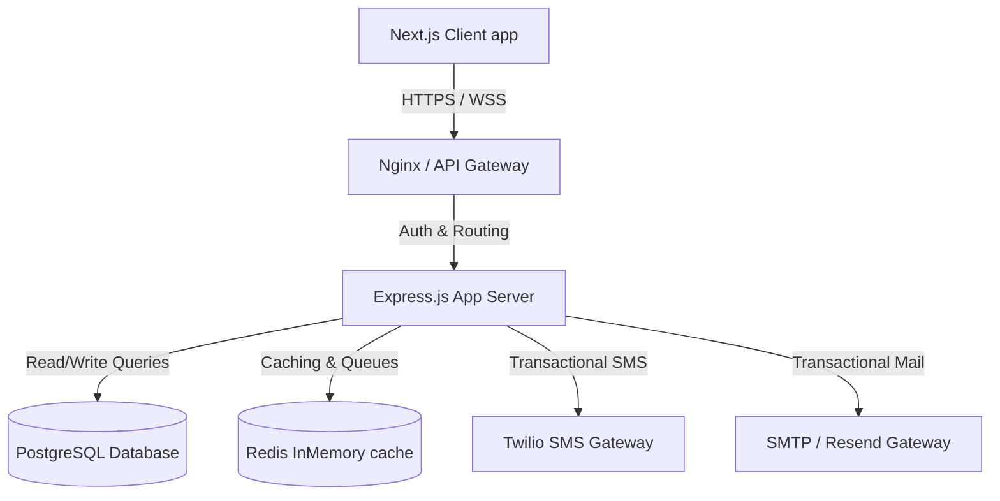

### Architecture Overview

HubNest CRM is built on a modern, decoupled service-oriented architecture designed to handle high concurrency, multi-tenant workspace isolation, and high-performance CRM operations.

### Core Components

#### 1. Frontend Client (Next.js)
- **Framework**: Next.js 16 (Turbopack) & React 19.
- **State Management**: Zustand for global state, React Context for themes.
- **Styling**: Tailwind CSS v4 featuring premium dark-mode custom color overrides.
- **Client Storage**: Dexie (IndexedDB wrapper) for offline caching and high-availability operations.

#### 2. Backend Server (Express.js)
- **Engine**: Node.js v20+ with Express.
- **ORM / Query Builder**: Knex / pg-pool for optimized connection pooling and migrations.
- **Authentication**: Stateless JSON Web Tokens (JWT) combined with Secure HTTPOnly Cookies.

#### 3. Data Tier (PostgreSQL & Redis)
- **PostgreSQL**: Stores relational transactional data (Users, Tenants, Leads, Invoices, Departments).
- **Redis**: Handles session storage, rate limiting, and caching of high-frequency datasets (like active subscription parameters).

#### 4. Event Processing
- BullMQ backed by Redis for background tasks, such as generating email campaigns and tracking webhook retries.
