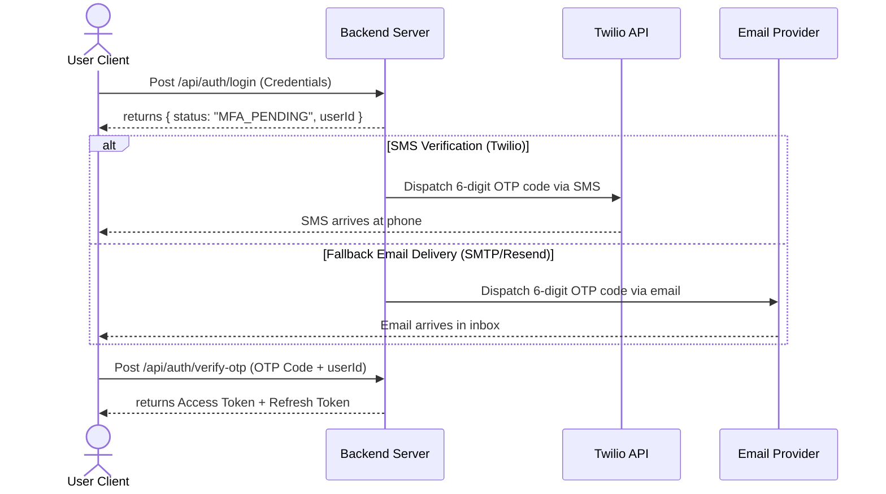

### Authentication Architecture

HubNest CRM implements stateless security tokens using JSON Web Tokens (JWT). The tokens are partitioned into two tiers:
1. **Access Token**: Short-lived token (15-minute expiration) sent via an `Authorization: Bearer <token>` HTTP header or read from secure client cookies.
2. **Refresh Token**: Long-lived token (7-day expiration) stored inside an HTTPOnly, secure cookie to request new access tokens.

---

### Multi-Factor Authentication (MFA) Flow

For administrative roles (Super Admin, Admin, and Finance Manager), MFA is enabled by default. The system orchestrates authentication steps via SMS and email channels:



---

### Step-by-Step MFA Operations

#### 1. Credentials Submission
The user enters their email and password on `/auth/login`. The server verifies the cryptographic password hash:
```javascript
const isValid = await bcrypt.compare(password, user.password_hash);
```
If valid, the server checks if the user has `mfa_enabled` active. If enabled, it generates a random 6-digit verification code and saves it to Redis with a 5-minute (300 seconds) expiration:
```javascript
const otp = Math.floor(100000 + Math.random() * 900000).toString();
await redis.set(`otp:${userId}`, otp, 'EX', 300);
```

#### 2. SMS OTP Dispatch
The server calls the Twilio REST API to dispatch the code:
```javascript
await twilio.messages.create({
  body: `Your HubNest CRM authorization code is: ${otp}. Valid for 5 minutes.`,
  from: process.env.TWILIO_PHONE_NUMBER,
  to: user.phone
});
```

#### 3. Automatic Email Fallback
If the Twilio API returns a gateway timeout or delivery status failure:
1. The server catches the exception.
2. It generates a fallback email dispatch task.
3. The server calls Resend (or SMTP) to deliver the OTP directly to the user's inbox:
```javascript
await resend.emails.send({
  from: 'security@hubnest.com',
  to: user.email,
  subject: 'HubNest CRM - Your Authentication OTP Code',
  html: `<p>Your verification code is: <strong>${otp}</strong>.</p>`
});
```

#### 4. Code Verification
The user enters the code on `/auth/verify-otp`. The server reads the code from Redis:
- If the values match, it invalidates the OTP key and issues the JWT token suite.
- If it fails, a warning counter is updated in Redis. If a user enters an incorrect OTP 5 times consecutively, the account is temporarily locked for 1 hour to prevent brute-force attacks.
