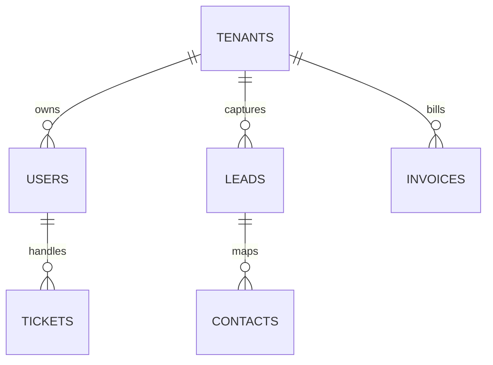

### Database Architecture

HubNest CRM uses PostgreSQL as the primary relational database. Row-level data isolation is managed using the `tenant_id` foreign key.



### Core PostgreSQL Tables

#### 1. Tenants Table
Stores organization workspace records.
```sql
CREATE TABLE tenants (
    id SERIAL PRIMARY KEY,
    name VARCHAR(255) NOT NULL,
    domain VARCHAR(255) UNIQUE,
    plan VARCHAR(50) DEFAULT 'Starter' CHECK (plan IN ('Starter', 'Pro', 'Enterprise', 'Custom')),
    status VARCHAR(50) DEFAULT 'Active' CHECK (status IN ('Active', 'Suspended', 'Trial')),
    created_at TIMESTAMP DEFAULT CURRENT_TIMESTAMP
);
```

#### 2. Users Table
Global authentication credentials directory.
```sql
CREATE TABLE users (
    id SERIAL PRIMARY KEY,
    tenant_id INTEGER REFERENCES tenants(id) ON DELETE CASCADE,
    email VARCHAR(255) UNIQUE NOT NULL,
    password_hash VARCHAR(255) NOT NULL,
    role VARCHAR(50) NOT NULL,
    status VARCHAR(50) DEFAULT 'Active',
    mfa_enabled BOOLEAN DEFAULT FALSE,
    created_at TIMESTAMP DEFAULT CURRENT_TIMESTAMP
);
CREATE INDEX idx_users_tenant ON users(tenant_id);
```

#### 3. Leads Table
Core database table for CRM pipelines.
```sql
CREATE TABLE leads (
    id SERIAL PRIMARY KEY,
    tenant_id INTEGER REFERENCES tenants(id) ON DELETE CASCADE,
    name VARCHAR(255) NOT NULL,
    email VARCHAR(255),
    phone VARCHAR(50),
    company VARCHAR(255),
    status VARCHAR(50) DEFAULT 'New',
    priority VARCHAR(50) DEFAULT 'Medium',
    assigned_to INTEGER REFERENCES users(id),
    created_at TIMESTAMP DEFAULT CURRENT_TIMESTAMP
);
CREATE INDEX idx_leads_tenant ON leads(tenant_id);
CREATE INDEX idx_leads_status ON leads(status);
```
