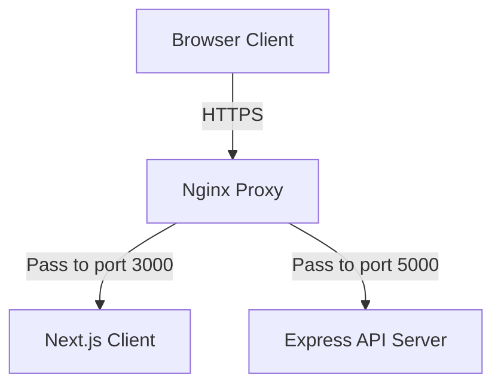

### Infrastructure Setup

Deploying HubNest CRM in production involves building the Next.js static files, running the Express.js APIs via a process manager (like PM2), and setting up a secure Nginx reverse proxy with SSL.



### 1. Build and Run Next.js Client
On your client application host machine, set the environment variables in `.env.production` and compile:
```bash
cd client
npm install
npm run build
pm2 start npm --name "hubnest-client" -- start
```

### 2. Run Backend Server
Ensure PostgreSQL database migrations are applied and start the Node process:
```bash
cd server
npm install
npm run migrate
pm2 start src/index.js --name "hubnest-api"
```

### 3. Configure Nginx Reverse Proxy
Add the block below inside your Nginx configuration directory at `/etc/nginx/sites-available/hubnest`:

```nginx
server {
    listen 80;
    server_name crm.company.com;

    location / {
        proxy_pass http://localhost:3000;
        proxy_http_version 1.1;
        proxy_set_header Upgrade $http_upgrade;
        proxy_set_header Connection 'upgrade';
        proxy_set_header Host $host;
        proxy_cache_bypass $http_upgrade;
    }

    location /api/ {
        proxy_pass http://localhost:5000;
        proxy_http_version 1.1;
        proxy_set_header Upgrade $http_upgrade;
        proxy_set_header Connection 'upgrade';
        proxy_set_header Host $host;
        proxy_cache_bypass $http_upgrade;
    }
}
```

### 4. Enable SSL via Let's Encrypt Certbot
To enforce HTTPS, generate an SSL certificate:
```bash
sudo certbot --nginx -d crm.company.com
```
