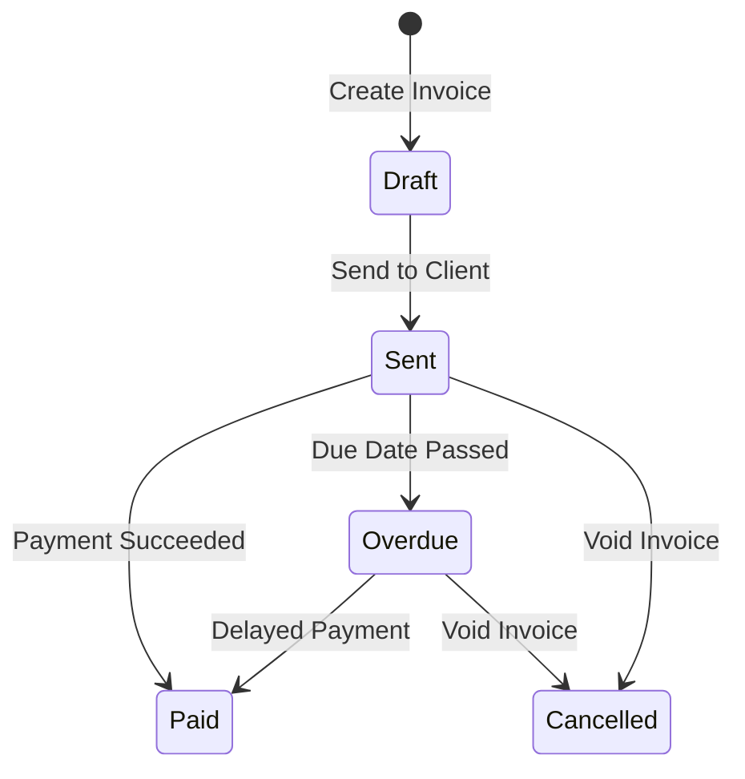

### Finance Portal Overview

HubNest CRM includes a complete Finance module that allows tenants to issue invoices, track expenses, reconcile transactions via Stripe or Razorpay, and manage payroll disbursements.

---

### Invoicing Lifecycle

Invoices transition through the states illustrated below:



#### Invoice States Detail
- **Draft**: The invoice is newly created, editable, and has not yet been logged to the tax registry.
- **Sent**: A secure PDF copy has been emailed to the customer with an active payment checkout link.
- **Paid**: Payment confirmation received from the gateway, updating the MRR/ARR analytics dashboards.
- **Overdue**: The invoice has passed its due date without payment. Automated reminder emails are dispatched daily.
- **Cancelled**: Voided invoice. It cannot be paid, and its balance is removed from accounts receivable calculations.

---

### payment Gateway Integrations

We support automated invoice reconciliation via Stripe and Razorpay integrations.

#### 1. Stripe Checkout Flow
When a customer clicks the payment link on an invoice:
1. HubNest calls Stripe to create a **Checkout Session**:
```javascript
const session = await stripe.checkout.sessions.create({
  payment_method_types: ['card'],
  line_items: [{
    price_data: {
      currency: 'usd',
      product_data: { name: `Invoice #${invoice.number}` },
      unit_amount: invoice.total * 100, // in cents
    },
    quantity: 1,
  }],
  mode: 'payment',
  success_url: `https://crm.hubnest.com/finance/payments/success?session_id={CHECKOUT_SESSION_ID}`,
  cancel_url: `https://crm.hubnest.com/finance/payments/cancel`,
});
```
2. The user is redirected to Stripe's secure checkout portal.
3. Upon payment completion, Stripe fires a `checkout.session.completed` event to the HubNest webhook server, which automatically updates the invoice state to `Paid`.

#### 2. Razorpay Checkout Flow
For domestic transactions, Razorpay offers UPI, Netbanking, and wallet systems. Checkout signatures are validated at the backend:
```javascript
const crypto = require('crypto');
const expectedSignature = crypto
  .createHmac('sha256', process.env.RAZORPAY_KEY_SECRET)
  .update(`${razorpay_order_id}|${razorpay_payment_id}`)
  .digest('hex');

if (expectedSignature === razorpay_signature) {
  // Update invoice status to paid...
}
```

---

### Invoice Creation Shortcuts

You can trigger the invoice creator modal automatically on load by appending query actions:
```
/finance/invoices?action=add
```
Use this parameter in links from Client Profile screens to save clicks.
