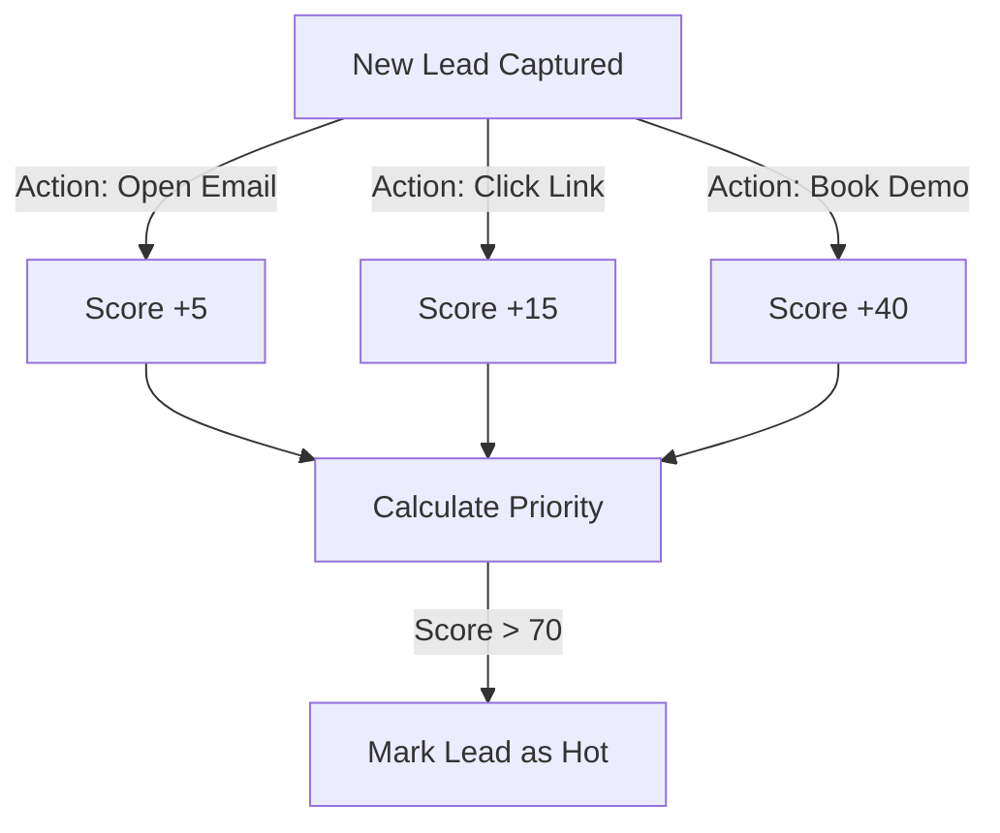

### Marketing Hub Overview

HubNest CRM integrates an advanced marketing suite that allows teams to construct campaigns, dispatch broadcast emails/SMS, track UTM links, and configure lead scoring pipelines.

---

### Key Performance Indicators (KPIs)

To evaluate campaign success, the Marketing dashboard aggregates three key metrics:

- **Cost Per Lead (CPL)**:
  `CPL = Campaign Budget / Total Leads Captured`

- **Return on Investment (ROI)**:
  `ROI = ((Revenue Generated - Campaign Budget) / Campaign Budget) * 100`

- **Conversion Rate**:
  `Conversion Rate = (Leads Converted to Won / Total Leads Captured) * 100`

---

### Campaign Tracking & Link Builder

Track lead traffic sources by appending UTM parameters to landing page links. The built-in URL builder outputs formatted links:
```
https://landing.hubnest.com/?utm_source=meta&utm_medium=cpc&utm_campaign=summer_sale
```

When a visitor registers through a tracking link, our Next.js client parses the query parameters and submits them during lead capture:
```javascript
const searchParams = new URLSearchParams(window.location.search);
const leadSource = {
  source: searchParams.get('utm_source') || 'Direct',
  medium: searchParams.get('utm_medium') || 'Organic',
  campaign: searchParams.get('utm_campaign') || 'Default',
};
```
These parameters are stored in the database, allowing you to filter lead metrics by UTM tags.

---

### Automated Lead Scoring

HubNest CRM uses an automation engine to rank leads from 0 to 100 based on their actions.



- **Engagement Triggers**: Increment score values automatically whenever a prospect reads emails (+5), visits the pricing page (+15), or registers for a demo (+40).
- **Decay Rules**: Decrease scores automatically by 5 points for every 14 days of inactivity.
- **Priority Alerts**: Once a lead score exceeds 70, the account is flagged as a "Hot Lead" and a Slack alert is sent to the assigned sales representative.
