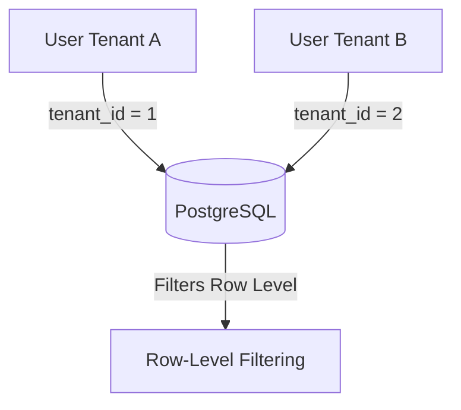

### Multi-Tenant Architecture

HubNest CRM implements a logical isolation approach inside a single shared PostgreSQL database. Each tenant workspace is isolated via a unique `tenant_id` foreign key.



### Key Multi-Tenant Features

#### 1. Tenant Workspace Provisioning
When a new organization registers:
1. A record is inserted into the `tenants` table.
2. Default configurations (Roles, default CRM Pipelines, and basic HR departments) are initialized for that `tenant_id`.
3. The creator is granted the `Tenant Admin` role.

#### 2. Data Isolation
All client tables (Leads, Contacts, Invoices, Departments) contain a `tenant_id` column. The Express.js backend runs database queries through a scoping middleware:
```javascript
const scopedQuery = knex('leads').where('tenant_id', req.tenant.id);
```

#### 3. Subscription Plan Limits
Tenants are constrained by their active plans:
- **Starter**: Up to 5 users, 1,000 leads, basic reporting.
- **Pro**: Up to 25 users, 10,000 leads, automated marketing.
- **Enterprise**: Unlimited users, unlimited leads, custom AI settings.

Usage metrics are periodically aggregated by cron tasks and checked in the routing middleware.
