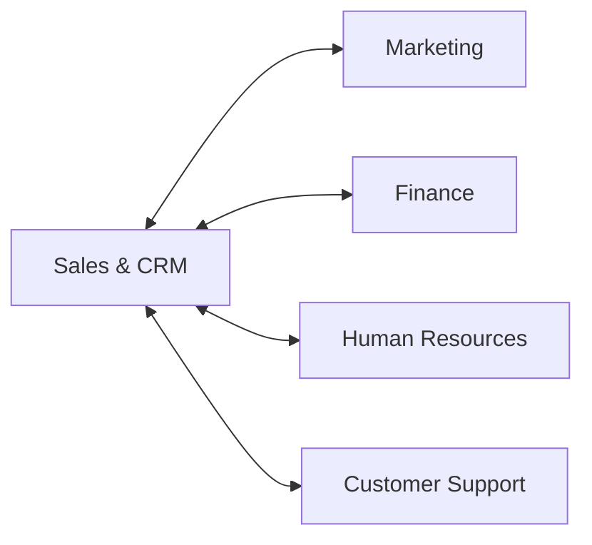

### HubNest CRM Overview
HubNest CRM is a premium, enterprise-grade multi-tenant SaaS platform built for modern businesses to orchestrate their sales, support, marketing, and finance departments under a single unified dashboard. By consolidating tools that usually require 3-4 separate software subscriptions, HubNest reduces operational costs and streamlines cross-department communication.

---

### Core Business Pillars

The platform is built around five operational pillars that connect departments dynamically:

#### 1. Sales & CRM Hub
- **Lead Pipelines**: Visual Kanban boards allowing sales teams to move leads from initial contact to close.
- **Deals & Contacts**: Unified directory of accounts, contact cards, activity timelines, and meeting schedulers.
- **Forecasting**: Advanced calculations projecting monthly recurring revenue (MRR) based on win probabilities.

#### 2. Marketing Hub
- **Campaign Tracker**: Track return on investment (ROI) across email, SMS, and digital ad campaigns.
- **SMS & Email Blasts**: Schedule high-volume communications with built-in variables.
- **Lead Nurturing**: Set automation workflows that update lead scores based on interactions.

#### 3. Finance Hub
- **Invoicing**: Automatic generation of invoices with secure Stripe and Razorpay checkout links.
- **Expense Log**: Logs operational and departmental expenditures, categorized for tax purposes.
- **Payroll**: Tracks monthly compensation schedules, allowances, and tax withholding.

#### 4. HR Hub
- **Employee Directory**: Central dashboard for management of staff files, department assignments, and job roles.
- **Time & Attendance**: GPS-restricted and IP-restricted check-in/out, logging monthly timesheets.
- **Leave Request Workflow**: Structured pathways for employees to request time off and managers to review.

#### 5. Support Desk
- **Ticket Desk**: Standardized ticketing interface prioritizing SLA reply deadlines.
- **Knowledge Base**: Markdown editor for staff to write articles, linking directly to the public-facing FAQ center.

---

### Key Technical Advantages

#### Multi-Tenant Security & Isolation
Every account workspace exists in a secure container. Data isolation is strictly enforced via logical scoping at the database query level (`tenant_id`), preventing cross-tenant leakage.

#### Offline Resilience with Dexie.js
If internet connectivity drops, HubNest's frontend automatically falls back to an offline sync engine. Changes are staged inside **IndexedDB** using Dexie.js and synchronized automatically as soon as the network becomes active.

#### AI-Powered Operations
- **Lead Prioritization**: Machine learning algorithm scores leads from 0-100 based on conversion likelihood.
- **Automated Routing**: Routes incoming support tickets to agents specialized in specific problem categories.
